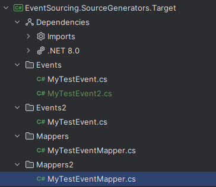

# Benchmarks

## 2025.05.20 Optimization of EventRegistry

This is the `EventRegistry` we will try to optimize with source generation.

It uses the dependency injection to get an `IEnumerable<IEventMapper>` from which it creates lookup dictionaries with the help of reflection. The methods of the event mapper are called by reflection, too.

```csharp
public class EventRegistry : IEventRegistry
{
    private readonly ILookup<string, Func<string, string, IEvent>> _deserializerLookup;
    private readonly ILookup<Type, Func<IEvent, ISerializedEvent>> _serializerLookup;

    public EventRegistry(IEnumerable<IEventMapper> eventMappers)
    {
        var mappers = eventMappers.ToArray();
        // TODO: Check for duplicate "Types" in eventMappers (the string as well as the event type)
        _serializerLookup = mappers
            .ToLookup(
                eventMapper => eventMapper.EventType, 
                eventMapper =>
                {
                    var serializeMethod = eventMapper.GetType().GetMethod("Serialize");
                    var serializeDelegate = (Func<IEvent, ISerializedEvent>)(@event => (ISerializedEvent)serializeMethod!.Invoke(eventMapper, [@event])!);
                    return serializeDelegate;
                });
        _deserializerLookup = mappers
            .SelectMany(em => em.Types.Select(t => new { Type = t, Mapper = em }))
            .ToLookup(
                typeAndMapper => typeAndMapper.Type, 
                typeAndMapper =>
                {
                    var deserializeMethod = typeAndMapper.Mapper.GetType().GetMethod("Deserialize")!;
                    var deserializeDelegate = (Func<string, string, IEvent>)((type, data) => (IEvent)deserializeMethod!.Invoke(typeAndMapper.Mapper, [type, data])!);
                    return deserializeDelegate;
                });
    }

    public ISerializedEvent Serialize(IEvent @event)
    {
        var serializer = _serializerLookup[@event.GetType()].FirstOrDefault();
        if (serializer is null)
            throw new EventRegistryException($"Event mapper for type {@event.GetType().Name} not found.");
        
        return serializer(@event);
    }

    public IEvent Deserialize(string type, string data)
    {
        var deserializer = _deserializerLookup[type].FirstOrDefault();
        if (deserializer is null)
            throw new EventRegistryException($"Event mapper for type {type} not found.");
        
        return deserializer(type, data);
    }
}
```

## 2025.05.21 Benchmarks for source-generated EventRegistry

The source generation finds all `AbstractEventMapper<T>` implementations and all `IEvent` implementations and creates an `EventRegistry` from it.

The methods `InitializeAbstractEventMappers` and `InitializeDefaultEventMappers` are generated. The first one is for the abstract mappers, the second one for the default mappers. There is no reflection used in the generated code. When an event(mapper) is added by the `InitializeAbstractEventMappers` it will not be overwritten by the `InitializeDefaultEventMappers`. 

### Generated Code 1

The code generated looks something like this:

```csharp
using System;
using System.Collections.Generic;
using EventSourcing.Mappers;
using FluentResults;

namespace EventSourcing.Generated
{
    public class EventRegistry
    {
        private readonly Dictionary<string, Func<string, string, IEvent>> _deserializers = new();
        private readonly Dictionary<Type, Func<IEvent, ISerializedEvent>> _serializers = new();

        public EventRegistry()
        {
            InitializeAbstractEventMappers();
            InitializeDefaultEventMappers();
        }

        private void InitializeAbstractEventMappers()
        {
            var mapper1 = new EventSourcing.SourceGenerators.Target.MyTestEventMapper();
            foreach (var typeSchema in mapper1.Types)
                _deserializers[typeSchema] = (type, data) => mapper1.Deserialize(type, data);
            _serializers[mapper1.EventType] = (@event) => mapper1.Serialize((dynamic)@event);

        }

        private void InitializeDefaultEventMappers()
        {
            if (!_serializers.ContainsKey(typeof(EventSourcing.SourceGenerators.Target.MyTestEvent)))
            {
                var mapper1 = new DefaultEventMapper<EventSourcing.SourceGenerators.Target.MyTestEvent>();
                foreach (var typeSchema in mapper1.Types)
                    _deserializers[typeSchema] = (type, data) => mapper1.Deserialize(type, data);
                _serializers[mapper1.EventType] = (@event) => mapper1.Serialize((dynamic)@event);
            }

        }

        public ISerializedEvent Serialize(IEvent @event)
        {
            if (!_serializers.TryGetValue(@event.GetType(), out var serializer))
                throw new InvalidOperationException($"No serializer found for type {@event.GetType().Name}");

            return serializer(@event);
        }

        public IEvent Deserialize(string type, string data)
        {
            if (!_deserializers.TryGetValue(type, out var deserializer))
                throw new InvalidOperationException($"No deserializer found for type {type}");

            return deserializer(type, data);
        }
    }
}
```

```
BenchmarkDotNet v0.14.0, Windows 11 (10.0.26100.3775)
Unknown processor
.NET SDK 9.0.300
  [Host]     : .NET 8.0.16 (8.0.1625.21506), X64 RyuJIT AVX2
  DefaultJob : .NET 8.0.16 (8.0.1625.21506), X64 RyuJIT AVX2


 Method                                     | Categories      | Mean     | Error   | StdDev  | Ratio | RatioSD | Gen0   | Allocated | Alloc Ratio |
------------------------------------------- |---------------- |---------:|--------:|--------:|------:|--------:|-------:|----------:|------------:|
 Create_ReflectingRegistry_SingletonMappers | Creation        | 220.2 ns | 4.23 ns | 4.15 ns |  1.00 |    0.03 | 0.0801 |    1008 B |        1.00 |
 Create_ReflectingRegistry_TransientMappers | Creation        | 422.1 ns | 7.82 ns | 6.53 ns |  1.92 |    0.04 | 0.1135 |    1424 B |        1.41 |
 Create_SourceGeneratedRegistry             | Creation        | 261.4 ns | 3.46 ns | 2.89 ns |  1.19 |    0.02 | 0.0839 |    1056 B |        1.05 |
                                            |                 |          |         |         |       |         |        |           |             |
 Deserialize_ReflectingRegistry             | Deserialization | 177.9 ns | 1.96 ns | 1.73 ns |  1.00 |    0.01 | 0.0157 |     200 B |        1.00 |
 Deserialize_SourceGeneratedRegistry        | Deserialization | 135.1 ns | 0.71 ns | 0.63 ns |  0.76 |    0.01 | 0.0126 |     160 B |        0.80 |
                                            |                 |          |         |         |       |         |        |           |             |
 Serialize_ReflectingRegistry               | Serialization   | 158.1 ns | 3.15 ns | 7.95 ns |  1.00 |    0.07 | 0.0114 |     144 B |        1.00 |
 Serialize_SourceGeneratedRegistry          | Serialization   | 115.0 ns | 1.71 ns | 1.60 ns |  0.73 |    0.04 | 0.0088 |     112 B |        0.78 |
```

### Generated Code 2

In order to omit the `if` statement in the `InitializeDefaultEventMappers` method, I keept book in the source generator in order to check if the event mapper was already added. This way there is no need to check because the source generator will not add the event mapper if it is already there.

The code generated looks something like this:

```csharp
using System;
using System.Collections.Generic;
using EventSourcing.Mappers;
using FluentResults;

namespace EventSourcing.Generated
{
    public class EventRegistry
    {
        private readonly Dictionary<string, Func<string, string, IEvent>> _deserializers = new();
        private readonly Dictionary<Type, Func<IEvent, ISerializedEvent>> _serializers = new();

        public EventRegistry()
        {
            InitializeAbstractEventMappers();
            InitializeDefaultEventMappers();
        }

        private void InitializeAbstractEventMappers()
        {
            var mapper1 = new EventSourcing.SourceGenerators.Target.MyTestEventMapper();
            foreach (var typeSchema in mapper1.Types)
                _deserializers[typeSchema] = (type, data) => mapper1.Deserialize(type, data);
            _serializers[mapper1.EventType] = (@event) => mapper1.Serialize((dynamic)@event);

        }

        private void InitializeDefaultEventMappers()
        {
        }

        public ISerializedEvent Serialize(IEvent @event)
        {
            if (!_serializers.TryGetValue(@event.GetType(), out var serializer))
                throw new InvalidOperationException($"No serializer found for type {@event.GetType().Name}");

            return serializer(@event);
        }

        public IEvent Deserialize(string type, string data)
        {
            if (!_deserializers.TryGetValue(type, out var deserializer))
                throw new InvalidOperationException($"No deserializer found for type {type}");

            return deserializer(type, data);
        }
    }
}

```

```
BenchmarkDotNet v0.14.0, Windows 11 (10.0.26100.3775)
Unknown processor
.NET SDK 9.0.300
  [Host]     : .NET 8.0.16 (8.0.1625.21506), X64 RyuJIT AVX2
  DefaultJob : .NET 8.0.16 (8.0.1625.21506), X64 RyuJIT AVX2


 Method                                     | Categories      | Mean     | Error   | StdDev   | Ratio | RatioSD | Gen0   | Allocated | Alloc Ratio |
------------------------------------------- |---------------- |---------:|--------:|---------:|------:|--------:|-------:|----------:|------------:|
 Create_ReflectingRegistry_SingletonMappers | Creation        | 235.2 ns | 4.74 ns |  4.44 ns |  1.00 |    0.03 | 0.0801 |    1008 B |        1.00 |
 Create_ReflectingRegistry_TransientMappers | Creation        | 436.8 ns | 8.66 ns | 12.69 ns |  1.86 |    0.06 | 0.1135 |    1424 B |        1.41 |
 Create_SourceGeneratedRegistry             | Creation        | 264.7 ns | 4.46 ns |  4.17 ns |  1.13 |    0.03 | 0.0839 |    1056 B |        1.05 |
                                            |                 |          |         |          |       |         |        |           |             |
 Deserialize_ReflectingRegistry             | Deserialization | 179.9 ns | 2.14 ns |  1.89 ns |  1.00 |    0.01 | 0.0157 |     200 B |        1.00 |
 Deserialize_SourceGeneratedRegistry        | Deserialization | 137.9 ns | 1.26 ns |  1.18 ns |  0.77 |    0.01 | 0.0126 |     160 B |        0.80 |
                                            |                 |          |         |          |       |         |        |           |             |
 Serialize_ReflectingRegistry               | Serialization   | 145.3 ns | 2.93 ns |  3.26 ns |  1.00 |    0.03 | 0.0114 |     144 B |        1.00 |
 Serialize_SourceGeneratedRegistry          | Serialization   | 114.8 ns | 2.21 ns |  2.07 ns |  0.79 |    0.02 | 0.0088 |     112 B |        0.78 |
```

There are no significant differences between the two generated codes. The second one is more readable - if someone ever reads the generated code.

### Generated Code 3

I wanted to see if a switch expression would be faster than the dictionary lookup. Unfortunately the switch expression is only usable for the serializer. The deserializer is a dictionary lookup because the type-schemas are not known at compile time.

```csharp
using System;
using System.Collections.Generic;
using EventSourcing.Mappers;
using FluentResults;

namespace EventSourcing.Generated
{
    public class EventRegistry2
    {
        private readonly EventSourcing.SourceGenerators.Target.MyTestEventMapper _myTestEventMapperMapper = new();
        private readonly Dictionary<string, Func<string, string, IEvent>> _deserializers = new();

        public EventRegistry2()
        {
            foreach (string schema in _myTestEventMapperMapper.Types)
                _deserializers.Add(schema, (typeSchema, data) => _myTestEventMapperMapper.Deserialize(typeSchema, data));
        }

        public ISerializedEvent Serialize(IEvent @event)
        {
            return @event.GetType() switch
            {
                { } type when type == typeof(EventSourcing.SourceGenerators.Target.MyTestEvent) => _myTestEventMapperMapper.Serialize((EventSourcing.SourceGenerators.Target.MyTestEvent)@event),
                _ => throw new InvalidOperationException($"No serializer found for type {@event.GetType().Name}")
            };
        }

        public IEvent Deserialize(string type, string data)
        {
            if (!_deserializers.TryGetValue(type, out var deserializer))
                throw new InvalidOperationException($"No deserializer found for type {type}");

            return deserializer(type, data);
        }
    }
}
```

```
BenchmarkDotNet v0.14.0, Windows 11 (10.0.26100.3775)
Unknown processor
.NET SDK 9.0.300
  [Host]     : .NET 8.0.16 (8.0.1625.21506), X64 RyuJIT AVX2
  DefaultJob : .NET 8.0.16 (8.0.1625.21506), X64 RyuJIT AVX2


| Method                                        | Categories      | Mean     | Error   | StdDev   | Median   | Ratio | RatioSD | Gen0   | Allocated | Alloc Ratio |
|---------------------------------------------- |---------------- |---------:|--------:|---------:|---------:|------:|--------:|-------:|----------:|------------:|
| Create_ReflectingRegistry_SingletonMappers    | Creation        | 225.7 ns | 3.08 ns |  2.73 ns | 225.1 ns |  1.00 |    0.02 | 0.0801 |    1008 B |        1.00 |
| Create_ReflectingRegistry_TransientMappers    | Creation        | 473.2 ns | 9.49 ns | 13.62 ns | 475.0 ns |  2.10 |    0.06 | 0.1135 |    1424 B |        1.41 |
| Create_SourceGeneratedRegistry                | Creation        | 260.2 ns | 5.04 ns |  7.39 ns | 257.5 ns |  1.15 |    0.03 | 0.0839 |    1056 B |        1.05 |
| Create_SourceGeneratedRegistry2               | Creation        | 232.3 ns | 4.56 ns | 10.57 ns | 227.1 ns |  1.03 |    0.05 | 0.0591 |     744 B |        0.74 |
|                                               |                 |          |         |          |          |       |         |        |           |             |
| Deserialize_ReflectingRegistry                | Deserialization | 177.9 ns | 2.25 ns |  2.10 ns | 177.2 ns |  1.00 |    0.02 | 0.0157 |     200 B |        1.00 |
| Deserialize_SourceGeneratedRegistry           | Deserialization | 139.6 ns | 1.62 ns |  1.51 ns | 139.9 ns |  0.78 |    0.01 | 0.0126 |     160 B |        0.80 |
| Deserialize_SourceGeneratedRegistry2          | Deserialization | 136.6 ns | 1.43 ns |  1.26 ns | 136.6 ns |  0.77 |    0.01 | 0.0126 |     160 B |        0.80 |
|                                               |                 |          |         |          |          |       |         |        |           |             |
| Serialize_ReflectingRegistry                  | Serialization   | 145.8 ns | 1.71 ns |  1.60 ns | 145.5 ns |  1.00 |    0.01 | 0.0114 |     144 B |        1.00 |
| Serialize_SourceGeneratedRegistry             | Serialization   | 120.7 ns | 2.41 ns |  5.13 ns | 118.8 ns |  0.83 |    0.04 | 0.0088 |     112 B |        0.78 |
| Serialize_SourceGeneratedRegistry2_SwitchCase | Serialization   | 104.5 ns | 1.66 ns |  1.55 ns | 104.0 ns |  0.72 |    0.01 | 0.0088 |     112 B |        0.78 |
```

The serialization with the switch expression is slightly faster than the dictionary lookup. I don't know if this is just a coincidence or if it is because I got rid of the `(dynamic)` cast. The deserialization is still a dictionary lookup because the type-schemas are not known at compile time.

The creation time is slightly faster, too. This is because only one dictionary is filles instead of two.

### Conclusion

I will use the source generator that creates the `EventRegistry` with switch expressions for the serializers and dictionary lookups for the deserializers. All in all it's faster than the reflection-based version and slightly faster than the dictionary-based version. 

I further added support for mappers and events with the same names in different namespaces. The older source generator was deleted.

The demo project looks like this:



Where:
- `Mappers.MyTestEventMapper` is `AbstractEventMapper<Events.MyTestEvent>`
- `Mappers2.MyTestEventMapper` is `AbstractEventMapper<Events.MyTestEvent2>`
- `Events2.MyTestEvent` has no mapper and is a `DefaultEventMapper<Events2.MyTestEvent>`

The generated code now looks like this:

```csharp
using System;
using System.Collections.Generic;
using EventSourcing.Mappers;
using FluentResults;

namespace EventSourcing.Generated
{
    public class EventRegistry
    {
        private readonly EventSourcing.SourceGenerators.Target.Mappers.MyTestEventMapper _eventSourcingSourceGeneratorsTargetMappersMyTestEventMapper = new();
        private readonly EventSourcing.SourceGenerators.Target.Mappers2.MyTestEventMapper _eventSourcingSourceGeneratorsTargetMappers2MyTestEventMapper = new();
        private readonly DefaultEventMapper<EventSourcing.SourceGenerators.Target.Events2.MyTestEvent> _eventSourcingSourceGeneratorsTargetEvents2MyTestEventMapper = new DefaultEventMapper<EventSourcing.SourceGenerators.Target.Events2.MyTestEvent>();
        private readonly Dictionary<string, Func<string, string, IEvent>> _deserializers = new();

        public EventRegistry()
        {
            foreach (string schema in _eventSourcingSourceGeneratorsTargetMappersMyTestEventMapper.Types)
                _deserializers.Add(schema, (typeSchema, data) => _eventSourcingSourceGeneratorsTargetMappersMyTestEventMapper.Deserialize(typeSchema, data));
            foreach (string schema in _eventSourcingSourceGeneratorsTargetMappers2MyTestEventMapper.Types)
                _deserializers.Add(schema, (typeSchema, data) => _eventSourcingSourceGeneratorsTargetMappers2MyTestEventMapper.Deserialize(typeSchema, data));
            foreach (string schema in _eventSourcingSourceGeneratorsTargetEvents2MyTestEventMapper.Types)
                _deserializers.Add(schema, (typeSchema, data) => _eventSourcingSourceGeneratorsTargetEvents2MyTestEventMapper.Deserialize(typeSchema, data));
        }

        public ISerializedEvent Serialize(IEvent @event)
        {
            return @event.GetType() switch
            {
                { } type when type == typeof(EventSourcing.SourceGenerators.Target.Events.MyTestEvent) => _eventSourcingSourceGeneratorsTargetMappersMyTestEventMapper.Serialize((EventSourcing.SourceGenerators.Target.Events.MyTestEvent)@event),
                { } type when type == typeof(EventSourcing.SourceGenerators.Target.Events.MyTestEvent2) => _eventSourcingSourceGeneratorsTargetMappers2MyTestEventMapper.Serialize((EventSourcing.SourceGenerators.Target.Events.MyTestEvent2)@event),
                { } type when type == typeof(EventSourcing.SourceGenerators.Target.Events2.MyTestEvent) => _eventSourcingSourceGeneratorsTargetEvents2MyTestEventMapper.Serialize((EventSourcing.SourceGenerators.Target.Events2.MyTestEvent)@event),
                _ => throw new InvalidOperationException($"No serializer found for type {@event.GetType().Name}")
            };
        }

        public IEvent Deserialize(string type, string data)
        {
            if (!_deserializers.TryGetValue(type, out var deserializer))
                throw new InvalidOperationException($"No deserializer found for type {type}");

            return deserializer(type, data);
        }
    }
}

```

The generated code is pretty readable (although the fieldNames are a bit long) and the performance is good as stated before.

Benchmarks look like this:

```

BenchmarkDotNet v0.14.0, Windows 11 (10.0.26100.3775)
Unknown processor
.NET SDK 9.0.300
  [Host]     : .NET 8.0.16 (8.0.1625.21506), X64 RyuJIT AVX2 DEBUG
  DefaultJob : .NET 8.0.16 (8.0.1625.21506), X64 RyuJIT AVX2


| Method                                     | Categories      | Mean        | Error     | StdDev    | Ratio | RatioSD | Gen0   | Gen1   | Allocated | Alloc Ratio |
|------------------------------------------- |---------------- |------------:|----------:|----------:|------:|--------:|-------:|-------:|----------:|------------:|
| Create_ReflectingRegistry_SingletonMappers | Creation        |   227.10 ns |  4.340 ns |  3.847 ns |  1.00 |    0.02 | 0.0801 |      - |    1008 B |        1.00 |
| Create_ReflectingRegistry_TransientMappers | Creation        |   485.73 ns |  9.285 ns | 22.425 ns |  2.14 |    0.10 | 0.1135 |      - |    1424 B |        1.41 |
| Create_SourceGeneratedRegistry             | Creation        | 1,150.55 ns | 15.390 ns | 14.396 ns |  5.07 |    0.10 | 0.2480 | 0.0019 |    3120 B |        3.10 |
|                                            |                 |             |           |           |       |         |        |        |           |             |
| Deserialize_ReflectingRegistry             | Deserialization |   179.50 ns |  2.643 ns |  2.343 ns |  1.00 |    0.02 | 0.0157 |      - |     200 B |        1.00 |
| Deserialize_SourceGeneratedRegistry        | Deserialization |   133.64 ns |  1.422 ns |  1.187 ns |  0.74 |    0.01 | 0.0126 |      - |     160 B |        0.80 |
|                                            |                 |             |           |           |       |         |        |        |           |             |
| Serialize_ReflectingRegistry               | Serialization   |   142.56 ns |  0.949 ns |  0.888 ns |  1.00 |    0.01 | 0.0114 |      - |     144 B |        1.00 |
| Serialize_SourceGeneratedRegistry          | Serialization   |    99.27 ns |  0.606 ns |  0.567 ns |  0.70 |    0.01 | 0.0088 |      - |     112 B |        0.78 |

```